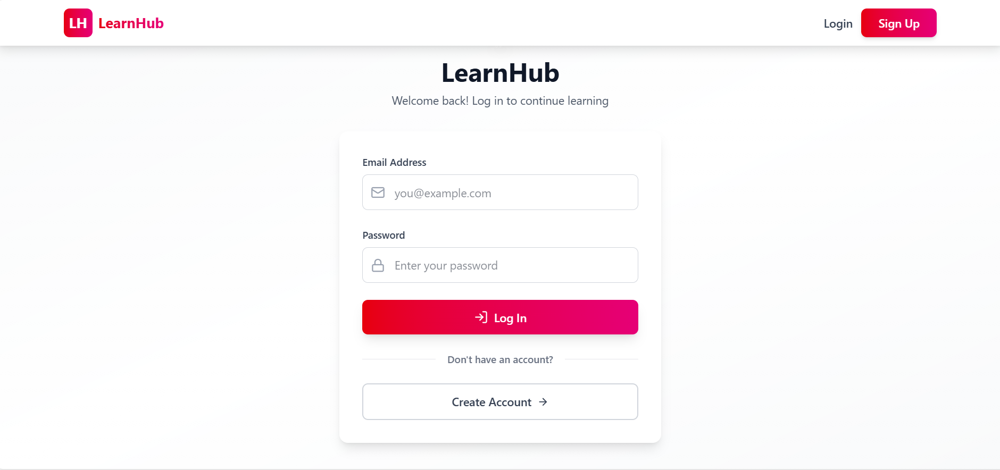
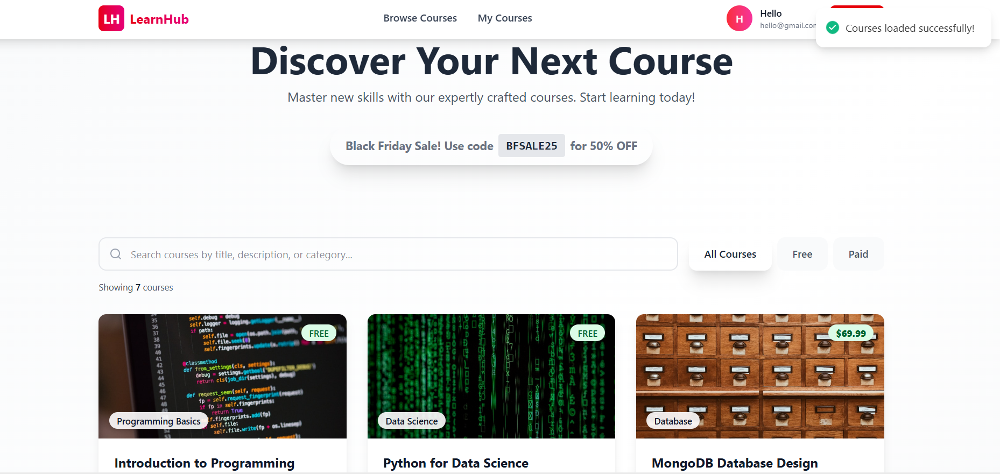
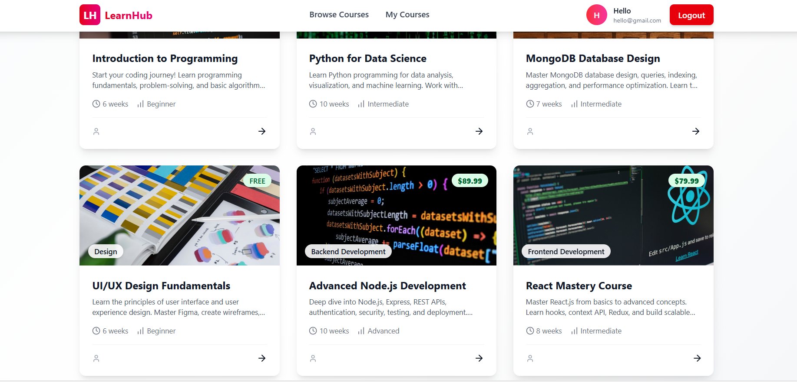
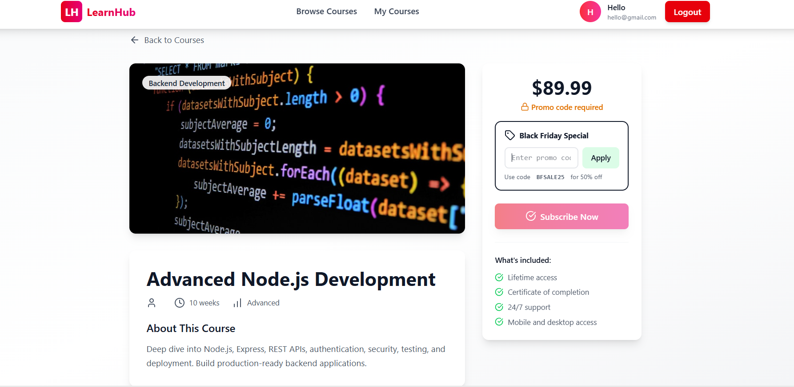
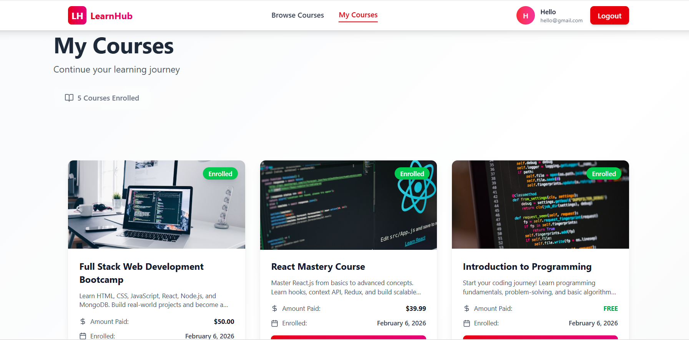
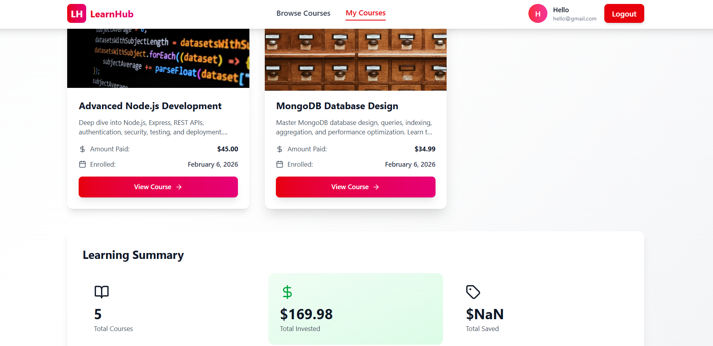

# 🎓 LearnHub - Mini Course Subscription Platform

[](https://vercel.com)
[](https://render.com)
[](https://reactjs.org/)
[](https://nodejs.org/)
[](https://www.mongodb.com/)

A modern, full-stack course subscription platform with authentication, promo code system, and beautiful UI. Built with MERN stack and deployed on **Vercel** (Frontend) and **Render** (Backend).

---

## 🌟 Live Demo

- **Demo :**  https://learn-hub-beta-flame.vercel.app/
- **Backend :** https://learnhub-whut.onrender.com/api

---

## 🖥️ Screenshots

  <br>
  
### Login Page


<br>

### SignUp Page


<br>

### Courses Page


<br>

### Courses Details


<br>

### Courses Enrolled Page


<br>

### MyCourses Page


<br>

### MyCourses Details Page


---

## ✨ Features

### 🔐 Authentication & Security
- JWT-based authentication with bcrypt password hashing
- Secure token management with 7-day expiration
- Protected routes on both frontend and backend
- Input validation and comprehensive error handling

### 📚 Course Management
- Browse 8+ sample courses across multiple categories
- Real-time search functionality
- Filter courses by type (All, Free, Paid)
- Detailed course pages with images and descriptions
- Categories: Web Development, Data Science, Design, Security, Cloud, Marketing

### 💳 Subscription System
- **Free Courses:** Instant one-click enrollment
- **Paid Courses:** Promo code required (mock payment)
- **Black Friday Sale:** Use code `BFSALE25` for 50% OFF
- Subscription tracking and history
- Duplicate subscription prevention

### 🎯 User Dashboard
- My Courses page displaying all enrolled courses
- Learning statistics (Total courses, Amount invested, Savings)
- Detailed subscription information
- Visual cards with course details

### 🎨 Modern UI/UX
- Beautiful gradient design with smooth animations
- Fully responsive (Desktop, Tablet, Mobile)
- Real-time toast notifications
- Loading states with skeleton loaders
- Professional color scheme
- Accessible design (WCAG AAA compliant)

---

## 🛠️ Tech Stack

### Frontend
- **React** 18.2 - UI library
- **React Router DOM** - Client-side routing
- **Axios** - HTTP client
- **TailwindCSS** - Styling
- **React Hot Toast** - Notifications
- **Lucide React** - Icons
- **Deployed on:** Vercel ☁️

### Backend
- **Node.js** - Runtime environment
- **Express.js** - Web framework
- **MongoDB** - Database
- **Mongoose** - ODM
- **JWT** - Authentication
- **bcryptjs** - Password hashing
- **CORS** - Cross-origin support
- **Deployed on:** Render ☁️

---

## 🚀 Local Setup

### 1️⃣ Clone Repository

```bash
git clone https://github.com/leonrock128/LearnHub.git
cd LearnHub
```

### 2️⃣ Backend Setup

```bash
cd backend
npm install

# Create .env file
cat > .env << EOF
PORT=5000
MONGODB_URI=mongodb://localhost:27017/mini-course-db
JWT_SECRET=your-super-secret-jwt-key-min-32-characters
NODE_ENV=development
PROMO_CODE=BFSALE25
PROMO_DISCOUNT=50


# Seed database
npm run seed

# Start server
npm start
```

Backend runs on `http://localhost:5000`

### 3️⃣ Frontend Setup

```bash
cd frontend
npm install

# Create .env file
echo "REACT_APP_API_URL=http://localhost:5000/api" > .env

# Start server
npm start
```

Frontend runs on `http://localhost:3000`

---

## 🔑 Demo Credentials

| Email | Password |
|-------|----------|
| `john@example.com` | `password123` |
| `jane@example.com` | `password123` |
| `mike@example.com` | `password123` |

**Promo Code:** `BFSALE25` (50% OFF)

---


## 🗂️ Project Structure

```
learnhub/
│
├── backend/                 # Node.js/Express API
│   ├── controllers/        # Business logic
│   ├── models/            # MongoDB schemas
│   ├── routes/            # API routes
│   ├── middleware/        # Auth middleware
│   ├── server.js          # Express setup
│   ├── seed.js            # Database seeder
│   └── .env               # Environment variables
│
├── frontend/               # React App
│   ├── public/
│   ├── src/
│   │   ├── components/    # Navbar, ProtectedRoute
│   │   ├── context/       # AuthContext
│   │   ├── pages/         # Login, Signup, Home, etc.
│   │   ├── services/      # API client
│   │   ├── App.js
│   │   └── index.css
│   └── .env               # Environment variables
│
└── README.md              # This file
```

---

## 🔌 API Endpoints

### Authentication
- `POST /api/auth/signup` - Register user
- `POST /api/auth/login` - Login user
- `GET /api/auth/me` - Get current user (Protected)

### Courses
- `GET /api/courses` - Get all courses
- `GET /api/courses/:id` - Get single course
- `GET /api/courses/categories` - Get categories
- `GET /api/courses/stats` - Get statistics

### Subscriptions (Protected)
- `POST /api/subscribe` - Subscribe to course
- `GET /api/my-courses` - Get user's courses
- `GET /api/subscriptions/stats` - Get statistics
- `POST /api/subscriptions/validate-promo` - Validate promo

---

## 📊 Performance Tips

- Enable compression
- Optimize images
- Add database indexes
- Use caching (Redis)
- Implement rate limiting
- Minify and bundle code

---

## 🔒 Security

### Implemented

- ✅ Password hashing (bcrypt)
- ✅ JWT authentication
- ✅ Input validation
- ✅ XSS protection
- ✅ CORS configuration
- ✅ Environment variables


### Recommended
- Rate limiting
- Helmet.js
- HTTPS enforcement
- CSP headers
- Regular audits

---

## 🤝 Contributing

1. Fork the repository
2. Create feature branch (`git checkout -b feature/amazing`)
3. Commit changes (`git commit -m 'Add feature'`)
4. Push to branch (`git push origin feature/amazing`)
5. Open Pull Request


---

## 👨‍💻 Author

**Ravi L**
- GitHub: [Ravi L - GitHub](https://github.com/leonrock128)
- LinkedIn: [Ravi L - LinkedIn](https://www.linkedin.com/in/ravi-l-70b894322/)

---

## 🗺️ Roadmap

### Future Features
- [ ] Real payments (Stripe)
- [ ] Video streaming
- [ ] Progress tracking
- [ ] Certificates
- [ ] Reviews & ratings
- [ ] Admin dashboard
- [ ] Email notifications

---

🚀 **Happy Learning!**
